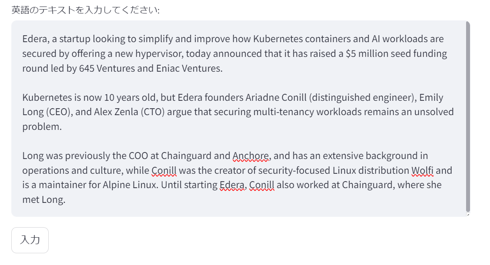
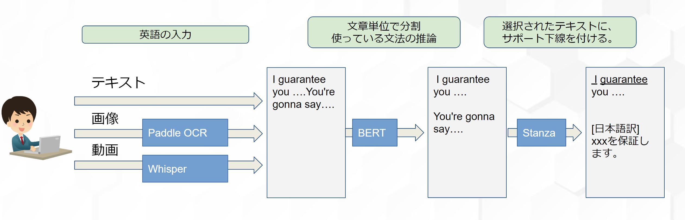

## Englisy Study Support


英語学習をサポートをするアプリです。  
テキスト、画像(マンガなど)、動画のいずれかで英語を入力してください。
以下の処理を行います。

- 文章単位で分割します。

- 受動態、完了形など、学習したい文法を使用した文章のフィルタリングが可能になります。

- それぞれの文章に主語・動詞・目的語などに下線を引いて表示します。

- 翻訳文の表示/非表示を切り替えできます。
  

## インストール

1. Git Cloneでプロジェクトをダウンロード。

2. 必要に応じて、仮想環境を有効にします。  
   ```
   python -m venv env` 
   source env/bin/activate (Windowsの場合: env\Scripts\activate)
   ```

   
3. ライブラリのインストールを行ってください。  
   `$ pip install -r ./requirements.txt`   

4. アプリを実行します。  
   `streamlit run main.py`

## チュートリアル

1. アプリを起動後、「テキスト」、「画像」ｌ「動画」のいずれかを選択して英語を入力します。  
 


   (例)テキストから入力  
   

 
2. 文章単位で分割されるので、アプリのサポートを受けて読みたい文を選択します。
   文法でのフィルタリングも可能です。  
   


3. 選択した文章がサポート付きで表示されます。
   日本語訳の表示/非表示の切り替えも可能です。 
   


## 仕様


## Model、ライブラリ

### Paddle OCR

PaddleOCRは、中国最大の検索エンジンの「Baidu(百度)」研究機関が開発した、ディープラーニングを使ったOCRライブラリです。  
画像から英語を入力するときに使用しています。  
https://github.com/PaddlePaddle/PaddleOCR


### Whisper

Whisperは、Open AIが開発した、音声認識モデルです。
動画から英語を入力するときに使用しています。  
https://github.com/openai/whisper


### Stanza

Stanzaは、Stanford NLPグループによって開発された自然言語処理パッケージです。
構文解析をして主語や動詞を抽出するのに使用しています。
https://github.com/stanfordnlp/stanza


### BERT (bert-base-uncased)

文章ごとの、文法予測をBERTモデルで行っています。
英語学習サイトの例文を使って、ファインチューニングしました。

## 環境
- Python 3.11.9