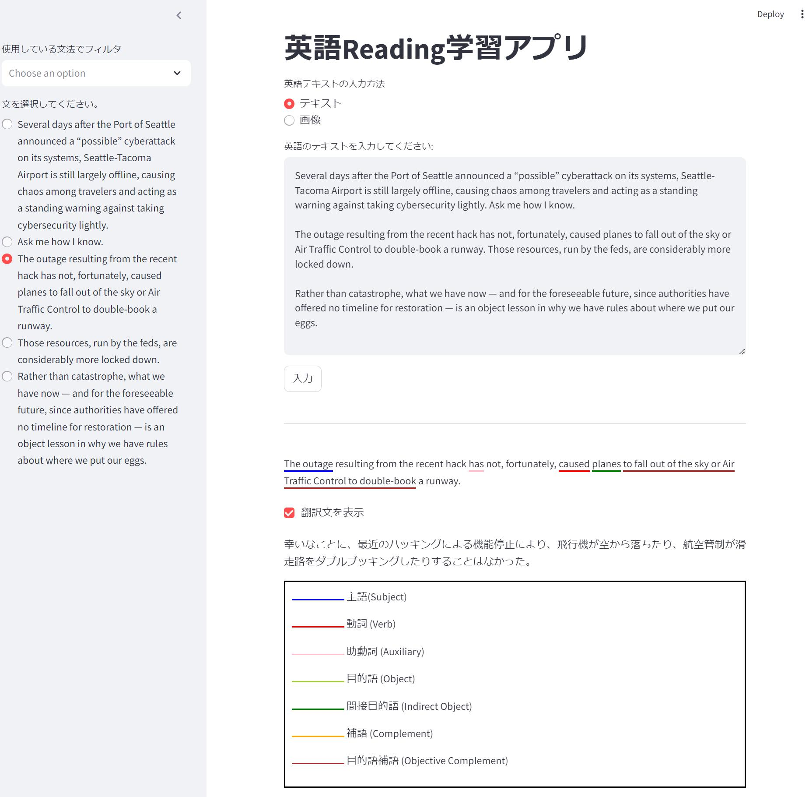
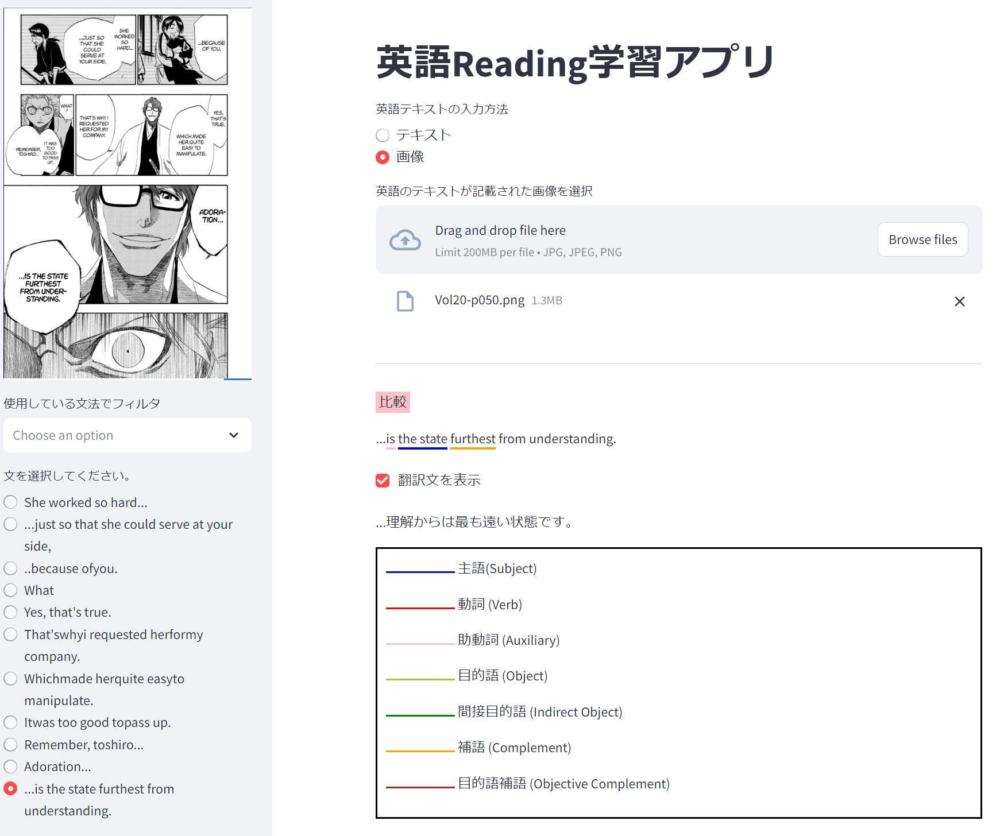

## 概要

英語のReadingサポートをするアプリです。  
自分の好きな記事やマンガでReadingの練習ができることを目指しました。

- 文章単位に分割して、それぞれの文の主語・動詞・目的語などに下線を引いて表示します。

- 受動態、完了形、WH名詞節など、特定の文法を使っている文章をフィルタリングします。

- 翻訳文の表示/非表示を切り替えできます。
  

## 動作イメージ

### テキストから入力
   

### 画像ファイルから入力
   

### 使用している文法でフィルタリング
   

## 使用技術

使用している文法の予測を機械学習で行っています。  
学習データには、英語学習サイトから集めた例文を用いています。
