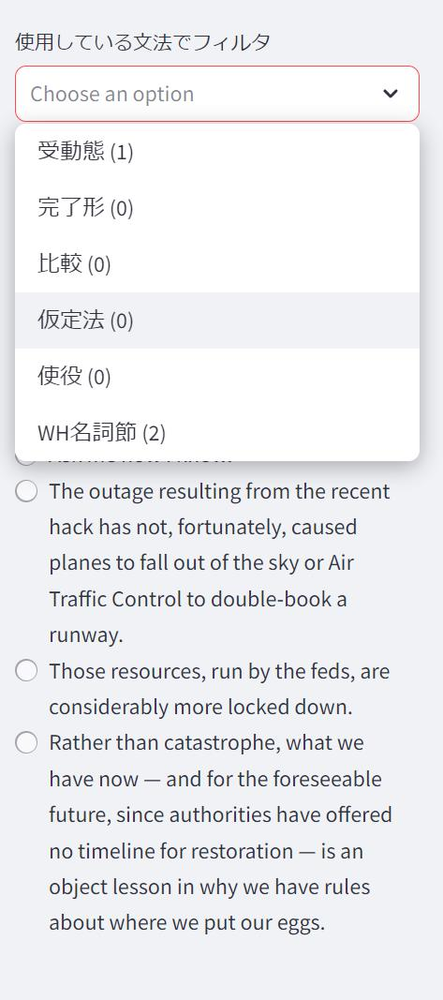
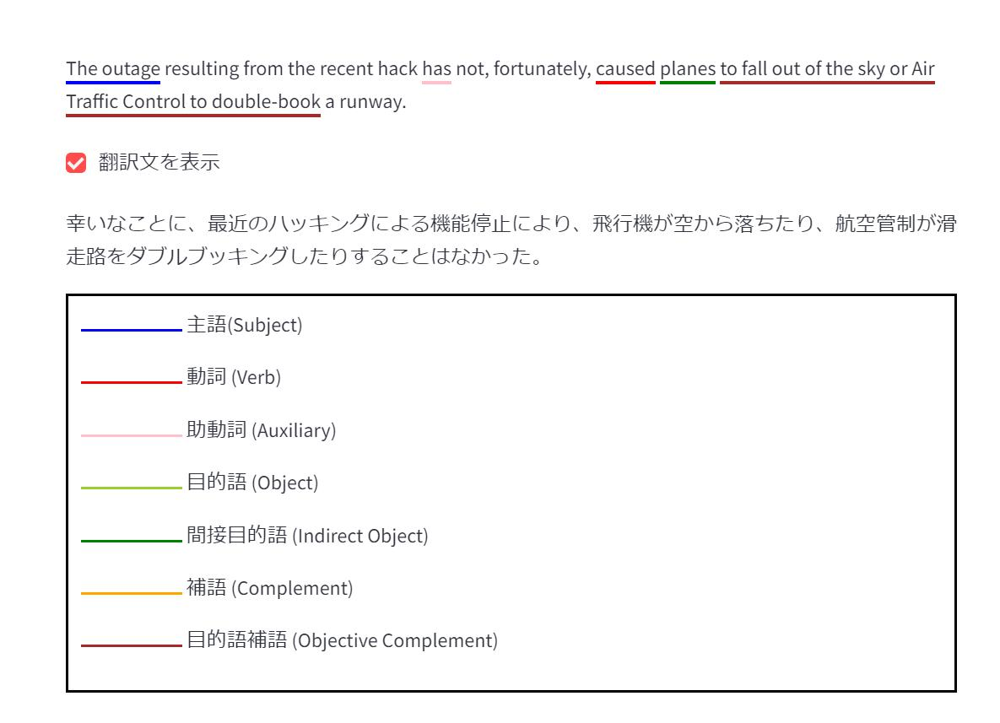

## 英語学習サポートアプリ


このアプリは、英語学習をサポートするためのツールです。テキスト、画像（マンガなど）、動画から英語を入力し、以下の処理を行います。

- 文章単位で分割
- 受動態、完了形などの文法でフィルタリング
- 主語・動詞・目的語などに自動で下線を引き、文構造を視覚化
- 翻訳文の表示/非表示の切り替え
  

## インストール

1. Git Cloneでプロジェクトをクローン

2. 必要に応じて、仮想環境を有効にしてください。 
   ```
   python -m venv env
   source env/bin/activate (Windowsの場合: env\Scripts\activate)
   ```

   
3. 依存ライブラリをインストール  
   `$ pip install -r ./requirements.txt`   

4. アプリを実行  
   `streamlit run main.py`

## チュートリアル

1. アプリを起動後、「テキスト」、「画像」、「動画」のいずれかを選択し、英語を入力します。  
 


   (例) テキスト入力の場合  
   

 
2. アプリが自動的に文章を分割し、学びたい文を選択できます。文法でフィルタリングも可能です。  
   


3. 選択した文章は、主語・動詞・目的語に下線が引かれた形で表示されます。  
   また、日本語訳の表示/非表示の切り替えが可能です。   
   


## 仕様


## Model、ライブラリ

### Paddle OCR

PaddleOCRは、Baiduが開発したディープラーニングベースのOCRライブラリです。画像から英語を入力する際に使用しています。  
https://github.com/PaddlePaddle/PaddleOCR


### Whisper

Whisperは、OpenAIが開発した音声認識モデルです。動画から英語を入力する際に使用しています。  
https://github.com/openai/whisper


### Stanza

Stanzaは、Stanford NLPグループが開発した自然言語処理パッケージです。文の構文解析に使用し、主語や動詞を抽出します。  
https://github.com/stanfordnlp/stanza


### BERT (bert-base-uncased)

文章ごとの、文法予測をBERTモデルで行っています。
英語学習サイトの例文を用いてファインチューニングしました。

## 環境
- Python 3.11.9